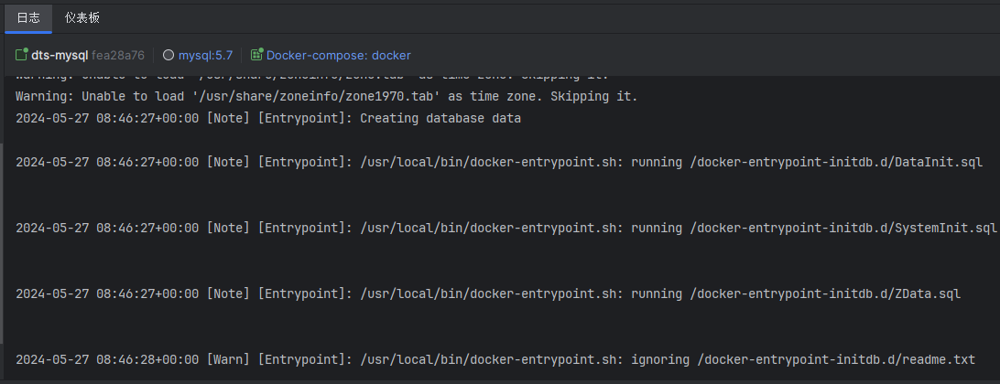
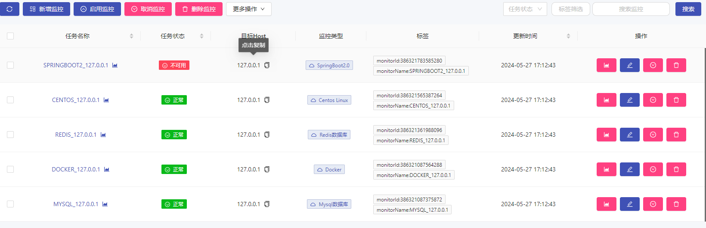
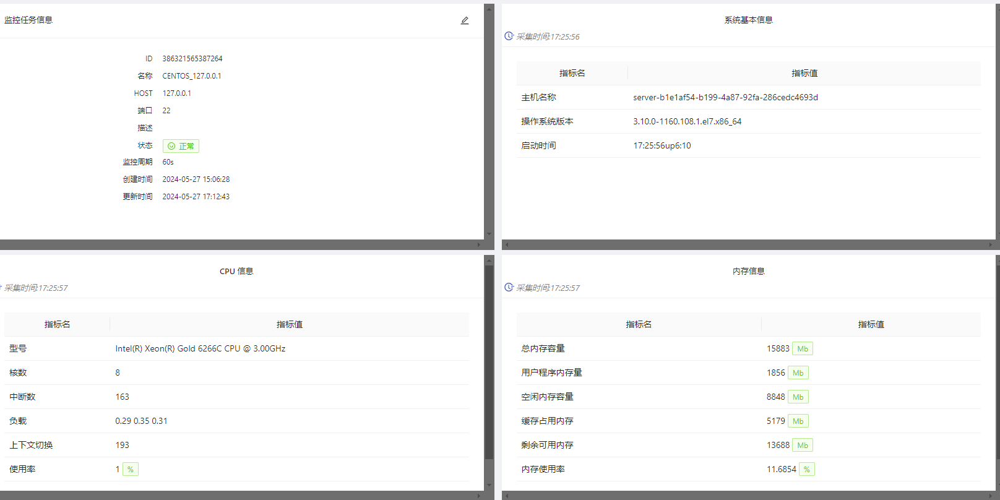
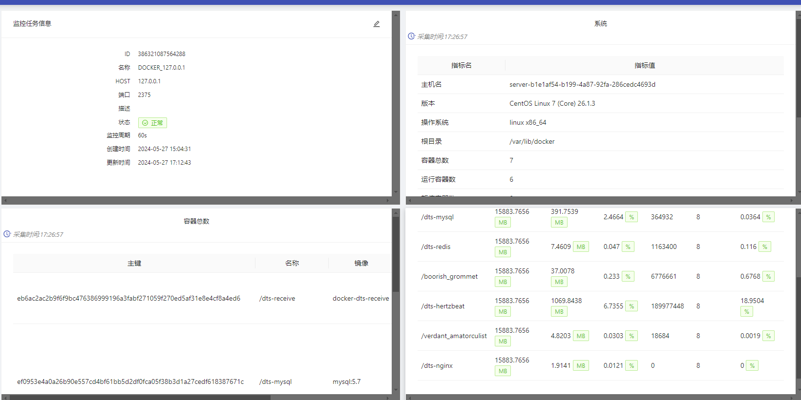

# 一 Docker Build & Up 😐

```text
一 centos安装docker
# 安装所需的软件包。yum-utils 提供了 yum-config-manager ，并且 device mapper 存储驱动程序需要 device-mapper-persistent-data 和 lvm2
sudo yum install -y yum-utils 
# 设置阿里云仓库
sudo yum-config-manager \
    --add-repo \
    https://mirrors.aliyun.com/docker-ce/linux/centos/docker-ce.repo
# 安装最新版本的 Docker Engine-Community 和 containerd
sudo yum install docker-ce docker-ce-cli containerd.io docker-compose-plugin
# 启动
sudo systemctl start docker 

二 部署
# 查看暴露的端口
netstat -nlpt
# 修改配置文件暴露2375端口
vim /usr/lib/systemd/system/docker.service
添加在ExecStart行后面追加以下内容 -H tcp://0.0.0.0:2375
# 重新载入服务信息
systemctl daemon-reload
# 重启docker服务
systemctl restart docker.service
# 查看2375端口是否开启
netstat -nlpt
# 上传docker文件夹,进入docker文件夹,启动所有服务
docker compose up -d

三 更新服务
# 上传jar包至对应的docker文件夹下的jar文件夹下
docker stop [服务名称]
docker rm [服务名称]
docker rmi [镜像名称]
# 重启服务
docker compose up -d [服务名称]
# 示例
docker stop dts-receive
docker rm dts-receive
docker rmi docker-dts-receive
docker compose up -d dts-receive


```

# 二 注意事项 🤔

1. 上传后的docker文件夹下的目录不可随意更名或者移动,对应的都是服务挂载的配置和数据
2. 首次部署mysql时,/docker/mysql/db下的数据库初始化语句会自动执行,无需额外初始化数据库,如需重新初始化,删除/docker/mysql/data下的所有数据
   

# 三 监控平台 😂

1. hertzbeat部署成功后,在监控中心页面导入hertzbeat_monitor.json即可实现对业务服务,centos,redis,mysql和docker的监控
   (默认账号密码 admin/hertzbeat ,默认访问端口:1157)
   
   
   
2. 在hertzbeat的消息通知页面新增接收对象后即可实现服务可用性告警

   


